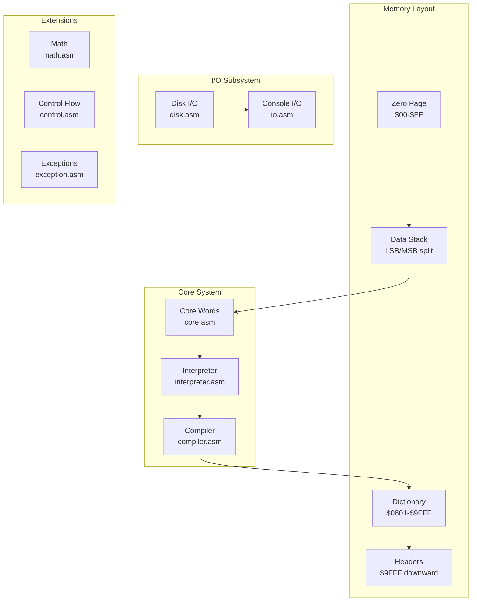
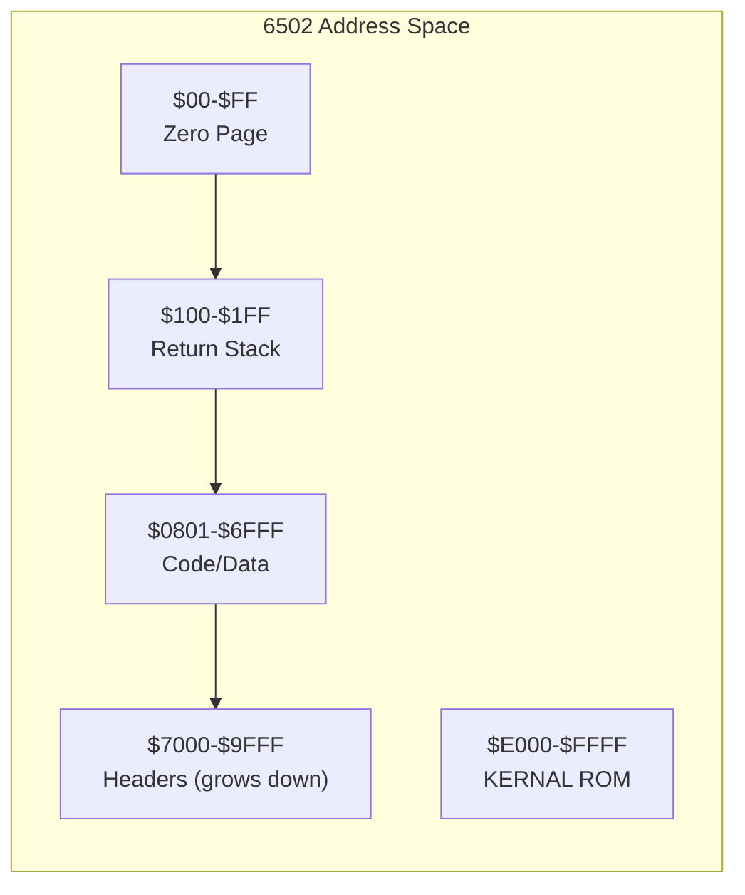
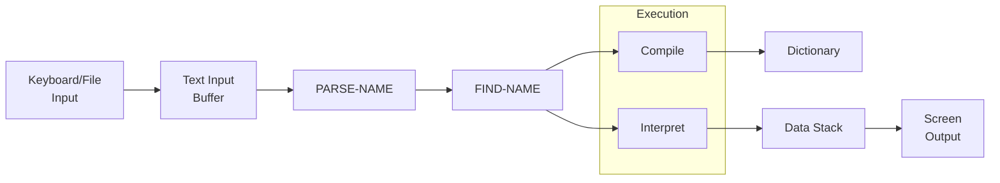

# Architecture: ChronoForth

## System Overview

ChronoForth is a subroutine-threaded Forth implementation for the Commodore 64,
targeting the MOS 6502 processor. The system provides a complete Forth 2012 core
standard implementation in under 8KB of machine code.

> **WASP Encoding Tuple** `(k, E, I, T, {F_q})`:
> - **k = 4**: Data stack, Return stack, Dictionary, I/O state
> - **E(r)**: (data_stack[32], return_stack[128], dictionary[38KB], io_state[ports])
> - **I(c)**: Split LSB/MSB zero-page stack (O(1)), linked-list dictionary (O(n)), hardware rstack
> - **T(q)**: Outer interpreter: PARSE-NAME → FIND-NAME → EXECUTE/COMPILE
> - **{F_q}**: Stack effect contracts: `( inputs -- outputs )` per word

### Component Diagram



## Component Breakdown

### Component 1: Interpreter

**File Location:** `asm/interpreter.asm`
**Responsibility:** Parse and execute Forth words
**Inputs:** Text input buffer
**Outputs:** Execution of compiled or interpreted words
**Dependencies:** Core words, compiler

The interpreter implements the Forth outer interpreter loop:

1. Parse next word from input
2. Look up in dictionary
3. Execute or compile based on STATE

### Component 2: Compiler

**File Location:** `asm/compiler.asm`
**Responsibility:** Compile new word definitions
**Inputs:** Colon definitions, CREATE/DOES>
**Outputs:** Subroutine-threaded code in dictionary
**Dependencies:** Interpreter, core words

Key compilation strategy:

- Subroutine threading (JSR/RTS)
- Tail call elimination (JSR+RTS to JMP)
- Inline optimization for DROP, DUP, etc.

### Component 3: Core Words

**File Location:** `asm/core.asm`
**Responsibility:** Fundamental stack and memory operations
**Inputs:** Data stack values
**Outputs:** Modified stack state
**Dependencies:** Zero page variables

```asm
; Example: DUP implementation (6 cycles, 6 bytes)
DUP
    dex                 ; 2 cycles - make room on stack
    lda MSB + 1, x      ; 4 cycles - copy MSB
    sta MSB, x
    lda LSB + 1, x      ; 4 cycles - copy LSB
    sta LSB, x
    rts                 ; 6 cycles
```

### Component 4: Math Operations

**File Location:** `asm/math.asm`
**Responsibility:** Arithmetic and logical operations
**Inputs:** Stack operands
**Outputs:** Computed results
**Dependencies:** Core words

Implements: `* / MOD /MOD */ UM* UM/MOD`

### Component 5: Disk I/O

**File Location:** `asm/disk.asm`
**Responsibility:** File operations via IEC bus
**Inputs:** Filenames, device numbers
**Outputs:** Loaded/saved data
**Dependencies:** KERNAL ROM routines

## SOLID Principles Applied

| Principle | Implementation |
|-----------|----------------|
| **S** (Single Responsibility) | Each .asm file handles one subsystem |
| **O** (Open/Closed) | New words extend dictionary without modifying core |
| **L** (Liskov Substitution) | All words follow stack effect contracts |
| **I** (Interface Segregation) | Minimal word set in core; extensions loadable |
| **D** (Dependency Inversion) | Words depend on stack abstraction, not implementation |

## Memory Map



### Zero Page Layout

| Address | Name | Purpose |
|---------|------|---------|
| $02-$21 | LSB | Data stack low bytes |
| $22-$41 | MSB | Data stack high bytes |
| $42-$43 | W | Work register |
| $44-$45 | W2 | Work register 2 |
| $46-$47 | W3 | Work register 3 |
| $48 | X | Stack pointer backup |

## Data Flow



## Threading Model

ChronoForth uses subroutine threading for execution:

```text
: DOUBLE  DUP + ;

Compiles to:
    JSR DUP     ; Call DUP word
    JMP PLUS    ; Tail-call optimized + word
```

Benefits:

- Native 6502 call/return semantics
- Compatible with inline assembly
- Enables tail call elimination

---

*Standardized with chronoboiler (link removed; repo unavailable) v1.0.0*
