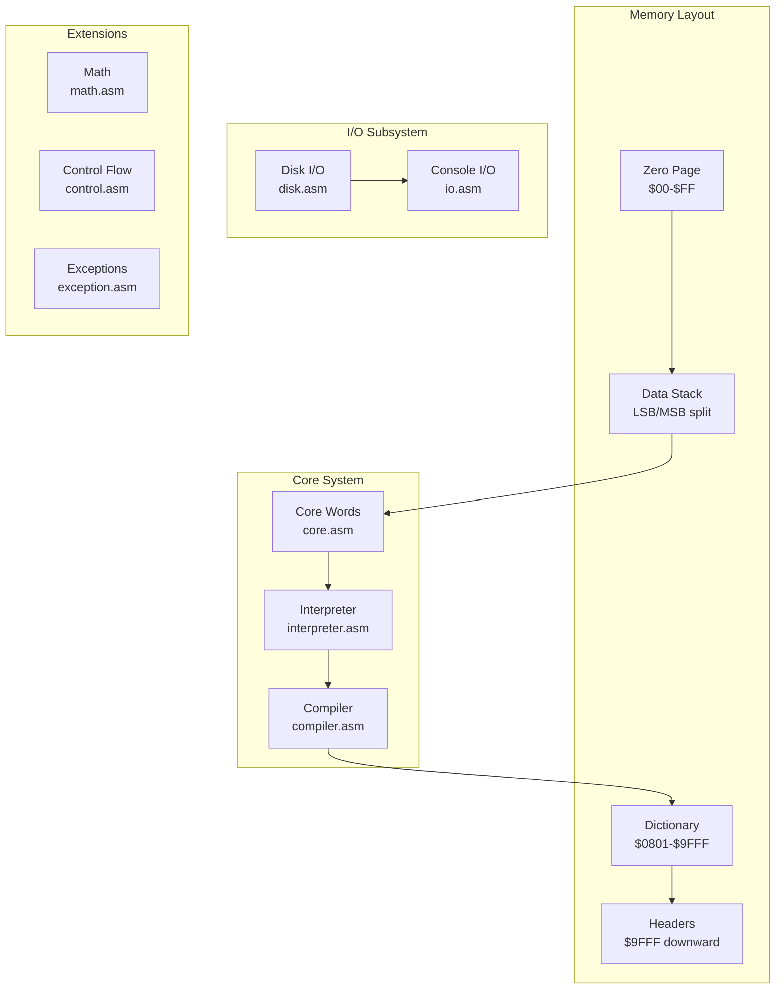
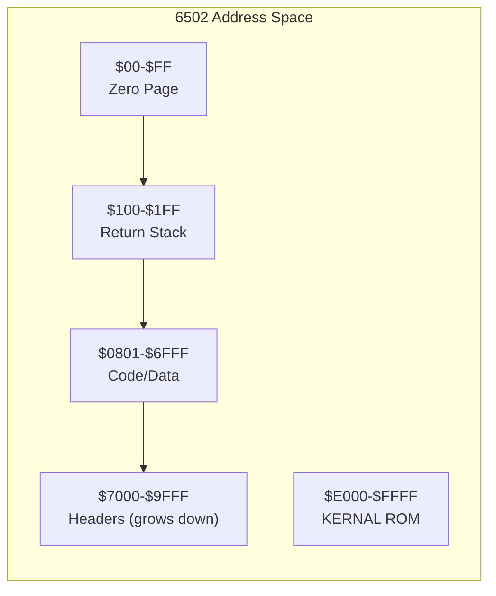
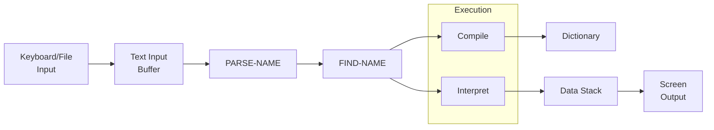

# Architecture: ChronoForth

## System Overview

ChronoForth is a subroutine-threaded Forth implementation for the Commodore 64,
targeting the MOS 6502 processor. The system provides a complete Forth 2012 core
standard implementation in under 8KB of machine code.

> **WASP Encoding Tuple** `(k, E, I, T, {F_q})`:
> - **k = 4**: Data stack, Return stack, Dictionary, I/O state
> - **E(r)**: (data_stack[32], return_stack[128], dictionary[38KB], io_state[ports])
> - **I(c)**: Split LSB/MSB zero-page stack (O(1)), linked-list dictionary (O(n)), hardware rstack
> - **T(q)**: Outer interpreter: PARSE-NAME → FIND-NAME → EXECUTE/COMPILE
> - **{F_q}**: Stack effect contracts: `( inputs -- outputs )` per word

### Component Diagram



## Component Breakdown

### Component 1: Interpreter

**File Location:** `asm/interpreter.asm`
**Responsibility:** Parse and execute Forth words
**Inputs:** Text input buffer
**Outputs:** Execution of compiled or interpreted words
**Dependencies:** Core words, compiler

The interpreter implements the Forth outer interpreter loop:

1. Parse next word from input
2. Look up in dictionary
3. Execute or compile based on STATE

### Component 2: Compiler

**File Location:** `asm/compiler.asm`
**Responsibility:** Compile new word definitions
**Inputs:** Colon definitions, CREATE/DOES>
**Outputs:** Subroutine-threaded code in dictionary
**Dependencies:** Interpreter, core words

Key compilation strategy:

- Subroutine threading (JSR/RTS)
- Tail call elimination (JSR+RTS to JMP)
- Inline optimization for DROP, DUP, etc.

### Component 3: Core Words

**File Location:** `asm/core.asm`
**Responsibility:** Fundamental stack and memory operations
**Inputs:** Data stack values
**Outputs:** Modified stack state
**Dependencies:** Zero page variables

```asm
; DUP implementation — 24 cycles, 10 bytes (verified: chrono6502 selftest)
DUP
    dex                 ; 2  - make room on stack
    lda MSB + 1, x      ; 4  - copy MSB
    sta MSB, x          ; 4
    lda LSB + 1, x      ; 4  - copy LSB
    sta LSB, x          ; 4
    rts                 ; 6
```

When `DUP` (or any of 30 hot primitives) is *compiled* into a definition, its
body is inlined directly — no `JSR`/`RTS` — by `asm/inline.asm`. See
[PERFORMANCE.md](PERFORMANCE.md).

### Component 4: Math Operations

**File Location:** `asm/math.asm`
**Responsibility:** Arithmetic and logical operations
**Inputs:** Stack operands
**Outputs:** Computed results
**Dependencies:** Core words

Implements: `* / MOD /MOD */ UM* UM/MOD`

### Component 5: Disk I/O

**File Location:** `asm/disk.asm`
**Responsibility:** File operations via IEC bus
**Inputs:** Filenames, device numbers
**Outputs:** Loaded/saved data
**Dependencies:** KERNAL ROM routines

### Component 6: Inline Threading

**File Location:** `asm/inline.asm`
**Responsibility:** Compile hot primitives as native code instead of `JSR` calls
**Inputs:** The xt being compiled by the outer interpreter
**Outputs:** Either an inlined body (position-independent machine code) or a normal `JSR`
**Dependencies:** Compiler (`compile_a`, `COMPILE_COMMA`), the no-TCE flag

`compile_xt` replaces `JMP COMPILE_COMMA` in the interpreter's compile path. It
looks the xt up in a small table of (address, body-length) for 30 hot
primitives and, when inlining is enabled, blits the body to `HERE`; otherwise it
falls through to the ordinary `JSR` compile. Inlining is a runtime-toggleable
optimizer (`+inline` / `-inline`); the system source is compiled with it off so
the turnkey image stays compact.

### Component 7: Verification Harness

**File Location:** [chrono6502](https://github.com/chronomancy-io/chrono6502) (Rust; its own repo, fetched into `tools/chrono6502/` by `make emu`)
**Responsibility:** Cycle-exact measurement and full-suite correctness, headless
**Inputs:** `durexforth.prg` + ACME symbols; Forth source served from `forth/`/`test/`
**Outputs:** Per-word cycle counts, stack-effect checks, pass/fail of the test suite
**Dependencies:** none (dependency-free 6502 core + minimal KERNAL/IEC stubs)

Boots the real ChronoForth in-process in ~0.1 s and runs the entire Forth-2012
suite as the correctness gate; measures any word's exact cycle cost. Validated
against hand-derivation, `cargo test`, and VICE. See
[PERFORMANCE.md](PERFORMANCE.md).

## SOLID Principles Applied

| Principle | Implementation |
|-----------|----------------|
| **S** (Single Responsibility) | Each .asm file handles one subsystem |
| **O** (Open/Closed) | New words extend dictionary without modifying core |
| **L** (Liskov Substitution) | All words follow stack effect contracts |
| **I** (Interface Segregation) | Minimal word set in core; extensions loadable |
| **D** (Dependency Inversion) | Words depend on stack abstraction, not implementation |

## Memory Map



### Zero Page Layout

Verified against `asm/durexforth.asm` (the X register is the data-stack pointer,
starting at 0 and decremented on push; zero-page,X access wraps within the page):

| Address | Name | Purpose |
|---------|------|---------|
| $03–$3a | LSB region | Data stack low bytes (base `LSB=$3b`, grows down) |
| $3b–$72 | MSB region | Data stack high bytes (base `MSB=$73`, grows down) |
| $8b–$8c | W | Work register |
| $8d–$8e | W2 | Work register 2 |
| $9e–$9f | W3 | Work register 3 |

## Data Flow



## Threading Model

ChronoForth uses subroutine threading for execution:

```text
: DOUBLE  DUP + ;

Compiles to:
    JSR DUP     ; Call DUP word
    JMP PLUS    ; Tail-call optimized + word
```

Benefits:

- Native 6502 call/return semantics
- Compatible with inline assembly
- Enables tail call elimination

---

*Standardized with chronoboiler (link removed; repo unavailable) v1.0.0*
